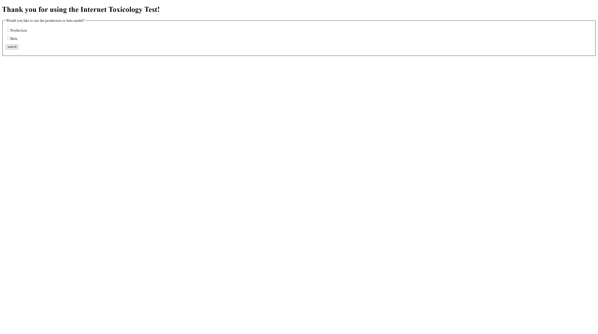
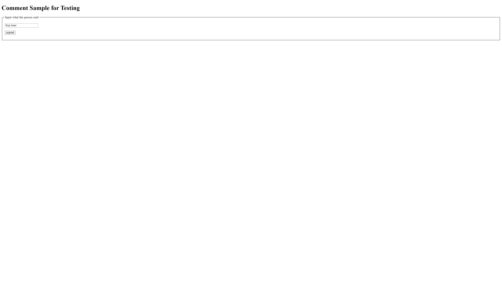
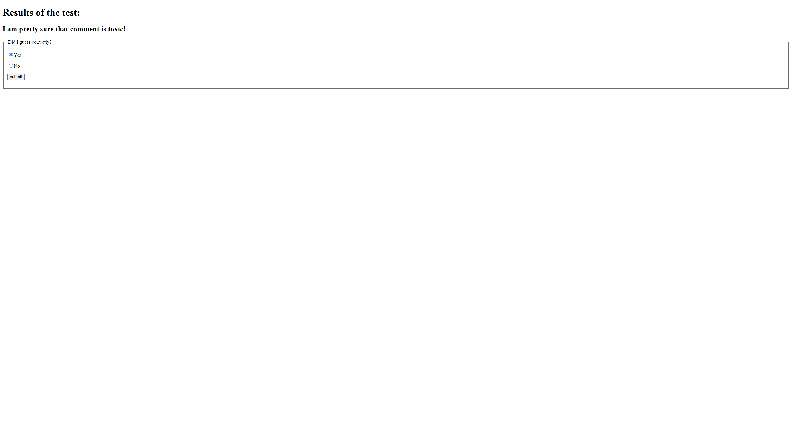
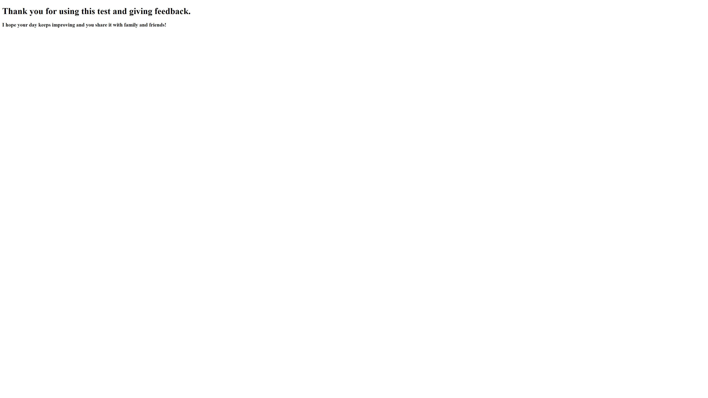

# Purpose

---

Forums and online discourse has expanded faster than moderation can keep up, and recent years have shown that hate speech
online has real-life consequences. This work aims to reduce hate speech and other toxic behavior online with machine learning.
The model can read text and determine if it is hateful, threatening, etc. The marked text can then either be flagged and 
double-checked by a human or removed in an automated fashion. 

# Data and Model

---

This work was built on data from a kaggle competition provided by Alphabet. It is a set of wikipedia comments that were
hand-coded by humans as to if and how they were toxic. 

The link to the data is: https://www.kaggle.com/c/jigsaw-toxic-comment-classification-challenge/data

The model itself uses the encoder-decoder version of the model in my thesis which can be found in https://github.com/eastmang/ucla-thesis.git

Everytime that a user runs and uses the model it updates the beta model based on the inputs. The user can choose to use
the production, or the beta model depending on their personal preference. 

The full work can be viewed by running the flask app in the app folder.

The below images are what it looks like when the user runs and walks through the app.

# For More

---

This work has a paper and presentation that go along with this code. They are the two pdfs shown in the repo
on the top-level folder, the paper should help clarify any questions left after reading this README. 